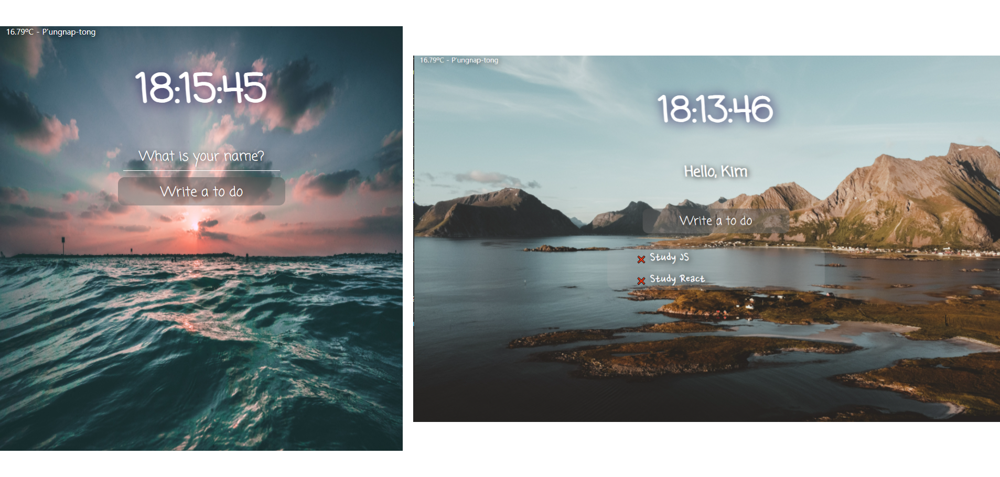

# Momentum Clone by Vanila Js

- 새로고침마다 배경화면 랜덤 표시
- 시간 나타내기 00:00:00 (시:분:초)
- 실시간 위치 날씨 나타내기
- 사용자 이름 local storage로 저장하기
- 추가 기능,
  지우기 기능
  

---

- Display random pictures after refreshing page
- Time 00:00:00 (Hour:Min:Sec)
- Show Location and weather
- By local storage save User name
- Add todo list, delete todo list
